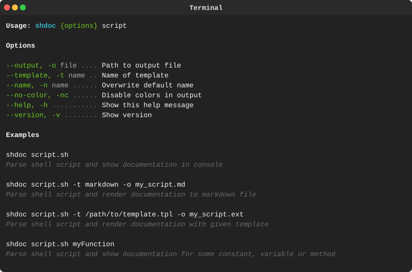

<p align="center"><a href="#readme"></a></p>

<p align="center">
  <a href="https://kaos.sh/y/shdoc"></a>
  <a href="https://kaos.sh/c/shdoc"></a>
  <br/>
  <a href="https://kaos.sh/w/shdoc/ci"></a>
  <a href="https://kaos.sh/w/shdoc/codeql"></a>
  <a href="#license"></a>
</p>

<p align="center"><a href="#usage-demo">Usage Demo</a> • <a href="#installation">Installation</a> • <a href="#usage">Usage</a> • <a href="#test--coverage-status">Test & Coverage Status</a> • <a href="#contributing">Contributing</a> • <a href="#license">License</a></p>

<br/>

`shdoc` is a tool for viewing and exporting documentation for shell scripts. The documentation format is described in the [specification](SPECIFICATION.md).

### Usage Demo

[](#usage-demo)

### Installation

#### From source

Make sure you have a working Go [1.25+](https://github.com/essentialkaos/.github/blob/master/GO-VERSION-SUPPORT.md) workspace ([instructions](https://go.dev/doc/install)), then:

```bash
go install github.com/essentialkaos/shdoc@latest
```

#### Prebuilt binaries

You can download prebuilt binaries for Linux and macOS from [EK Apps Repository](https://apps.kaos.st/shdoc/latest).

To install the latest prebuilt version of `shdoc`, do:

```bash
bash <(curl -fsSL https://apps.kaos.st/get) shdoc
```

### Upgrading

Since version `0.11.0` you can update `shdoc` to the latest release using [self-update feature](https://github.com/essentialkaos/.github/blob/master/APPS-UPDATE.md):

```bash
shdoc --update
```

This command will runs a self-update in interactive mode. If you want to run a quiet update (_no output_), use the following command:

```bash
shdoc --update=quiet
```

### Command-line completion

You can generate completion for `bash`, `zsh` or `fish` shell.

Bash:
```bash
shdoc --completion=bash | sudo tee /etc/bash_completion.d/shdoc > /dev/null
```

ZSH:
```bash
shdoc --completion=zsh | sudo tee /usr/share/zsh/site-functions/shdoc > /dev/null
```

Fish:
```bash
shdoc --completion=fish | sudo tee /usr/share/fish/vendor_completions.d/shdoc.fish > /dev/null
```

### Usage



### Test & Coverage Status

| Branch | CI       | Coveralls |
|--------|----------|-----------|
| `master` | [](https://kaos.sh/w/shdoc/ci?query=branch:master) | [](https://kaos.sh/c/shdoc?branch=master) |
| `develop` | [](https://kaos.sh/w/shdoc/ci?query=branch:develop) | [](https://kaos.sh/c/shdoc?branch=develop) |

### Contributing

Before contributing to this project please read our [Contributing Guidelines](https://github.com/essentialkaos/.github/blob/master/CONTRIBUTING.md).

### License

[Apache License, Version 2.0](https://www.apache.org/licenses/LICENSE-2.0)

<p align="center"><a href="https://kaos.dev"></a></p>
